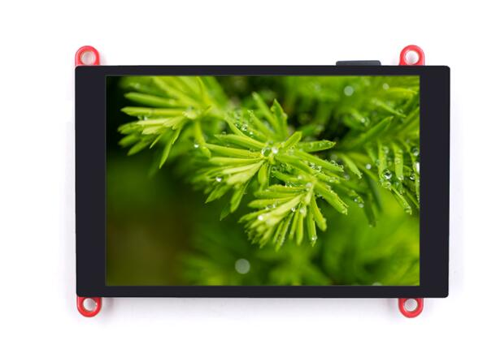
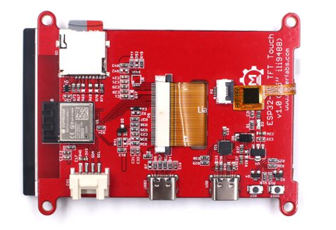
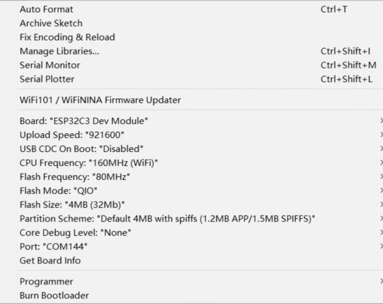
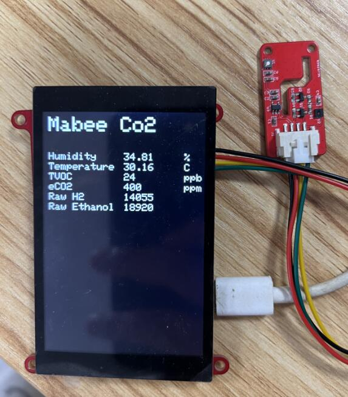

# Makerfabs ESP32-C3 SPI TFT with Touch

```c++
/*
Version:		V1.2
Author:			Vincent
Create Date:	2022/9/23
Note:
		2022/10/13	V1.1: Add example
		2022/10/18	V1.2: Add Line Chart demo
*/
```



[toc]

# Makerfabs

[Makerfabs home page](https://www.makerfabs.com/)

[Makerfabs Wiki](https://makerfabs.com/wiki/index.php?title=Main_Page)

# Makerfabs ESP32-C3 SPI TFT with Touch
## Intruduce

Product Link ：[ESP32-C3 SPI TFT with Touch 3.5'' ILI9488](https://www.makerfabs.com/ep32-c3-risc-v-spi-tft-touch.html)

Wiki Link : [ESP32-C3_SPI_TFT_with_Touch](https://www.makerfabs.com/wiki/index.php?title=ESP32-C3_SPI_TFT_with_Touch(3.5%27%27))

Makerfabs ESP32-C3 TFT Touch equips with ESP32-C3, which is a single-core Wi-Fi and Bluetooth 5 (LE) microcontroller SoC, built around a 32-bit **RISC-V** chip processor with a four-stage pipeline that operates at up to 160 MHz, with 4MB Flash, 400KB SRAM. 

Being a number of the Makerfabs ESP Display family, this ESP32 C3 SPI 3.5 inch Touch is 320*480, with ILI9488 driver. Same as the other Makerfab's ESP32 displays, there 2 USB connectors, one for USB2UART convertor, and 1 USB native; on-board SD card, and Mabee connector(I2C) which is Seeedstudio Grove compatible, so it fits for applications that need sensor connected.



## Feature

- Controller: ESP32-C3-MINI-1-N4, 4MB Flash, RISCV-32bit, 160MHz, 400KB SRAM, Bluetooth 5
- Wireless: WiFi & Bluetooth 5.0
- LCD: 3.5inch TFT LCD
- Resolution: 480*320
- Color: RGB
- LCD interface: SPI
- LCD Driver: ili9488
- Touch Panel: Capacitive
- Touch Panel Driver: FT6236
- USB: Dual USB Type-C(one for USB-to-UART and one for native USB)
- USB2UART Chip: CP2104
- Power Supply: USB Type-C 5.0V(4.0V~5.25V)
- Button: Flash button and reset button
- Mabee interface: 1*I2C
- Backlight Controller: Yes
- MicroSD: Yes
- Arduino support: Yes
- Type-C Power Delivery: Not Supported
- Operation temperature: -40℃ to +85℃
- Dimension: 66mm * 84.3mm * 12mm
- Weight: 52g

# Code Explain

## Complier Option

- Install board : ESP32 .
- Install library : LovyanGFX library. 
- Use type-c use cable connect USB-TTL to PC.
- Upload codes, select "ESP32-C3 DEV Module"



## Firmware

### c3_9488

A simple test procedure. Touch the black area in the middle of the screen, and the screen starts showing solid colors in turn. Finally, an SD card image is displayed.

## Example

### Mabee CO2 Display

SGP30 and SHT31 sensor values are displayed on the screen. Use [Mabee CO2](https://www.makerfabs.com/mabee-tvoc-and-eco2-sgp30-sht31.html) sensor.

Need libraries:

- Adafruit_SGP30
- Adafruit_SHT31




### TVOC line chart

Shows a line chart of TVOC